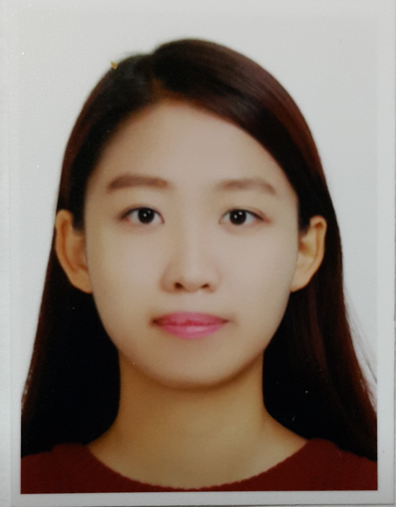

# 김도경의 이력서

## 정보
- 이름: 김도경
- 소속: 한림대학교 중국학과 

- 가장 좋아하는 교과목

  텍스트분석과 시각화 
  
- 가장 좋아하는 음식

  냉면
  
- 가장 좋아하는 운동

  자전거 타기 

상일여자고등학교 졸업 

학력사항

고등학교

학교명	상일여자고등학교	졸업일	2014/02/10

대학교

학교명	한림대학교

학과/전공	중국학과

학점	3.9/4.5

재직기간	2015/03/01(입학) ~ 2018/02/27 (재학)

### 외국어 능력

어학시험	점수(등급)	취득일
중국어 HSK	219	2017/12/28

### 수상경력

디지털인문예술 기말프로젝트 전시회 우수상	
2018년 2학기에 개최된 디지털인문예술 기말프로젝트 전시회에서 우수상 수상	한림대학교 소프트웨어 중심 대학교	2018/12/06

2018 한림 SW 해커톤 장려상	

한림대학교 소프트웨어 중심 대학교에서 개최한 2018 한림 SW 해커톤에 참가	한림대학교 소프트웨어 중심 대학교	2018/11/17

### 대외활동 경험

대외활동 경험
활동명	씨드스쿨
기관/장소	우석중학교
활동기간	2018/02/15~2018/12/31
활동내용	씨드스쿨은 청소년들이 자신의 정체성을 찾고 꿈과 재능을 꽃 피울 수 있도록 돕는 방과후 멘토링 학교입니다. 우석중학교 2학년들을 대상으로 한명의 멘티와 1대1 멘토링을 진행하여 1년간 멘토로 활동을 하였습니다. 아이들에게 자기자신에 대한 이해를 시작으로 자신이 하고 싶은 것, 걸어가야 될 길을 같이 닦아나가는 경험이 너무나도 소중한 경험이었고, 내가 먼저 좋은 모범을 보여야 된다는 생각으로 저 또한 많은 성장을 이루었던 활동이었습니다.

대외활동 경험
활동명	i-Seoul 자원봉사
기관/장소	서울시 관광협회
활동기간	2018/05/28~
활동내용	서울시 관광협회 i-Seoul에서 주관하는 관광안내 봉사 활동입니다. 홍대와, 동대문에서 외국인에게 관광통역안내 봉사활동을 하고있습니다. 중국어를 주언어로 통역봉사를 하고 있습니다. 중국어 외에도 영어, 일본어, 러시아어 봉사자분들도 계서서 조금씩 다른 언어들도 배워나가고 있습니다. 외국인들이 한국에 여행을 와서 완벽한 언어 구사는 아니지만 모국어로 안내를 받으면 한국에 대해 좋은 인상이 남을 수 있기에 저희가 하는 관광안내봉사가 한국에 대한 평판, 인지도에 나비효과를 가져올 것이라고 생각합니다.

대외활동 경험
활동명	DataBreak 운영진
기관/장소	DataBreak
활동기간	2019/02/01~
활동내용	DataBreak는 데이터 관련 현장에서 일하거나, 데이터 분야로 이직/취업하려는 사람들의 오프라인 밋업, 이벤트,스터디등에서 데이터를 이야기하고 연구할 수 있는 네트워킹 장소를 제공하는 그룹입니다. 저는 DataBreak 운영진에서 기획, 디자인팀에서 일을 하고 있습니다.
해외연수 및 해외경험

구분/국가명	어학연수/중국
기간	2016/02/18~2018/01/31
내용	2015년도에 한림대학교에서 1학년 재학 후 중국어를 더 잘하고 싶은 마음에 휴학을 하고 2016년부터 2년간 중국 하얼빈에 위치하고 있는 하얼빈 공업대학교에서 어학연수를 마치고 돌아왔습니다. HSK 6급을 합격하였고, 중국어 실력 향상뿐만 아니라 중국 문화에 대한 이해가 깊어지고, 다양한 국가의 사람들과의 교류를 통해서 나의 생각과 같지 않은 것은 틀린 것이 아니라 다른 것이라는 신념을 가지게 되었고, 배척이 아닌 이해와 포용심을 길렀습니다. 중국어를 잘하는 상태에서 간 것이 아니기 때문에 정말 생존을 위해서 중국어를 터득했고, 좌절도 있었지만 포기하지 않고 내가 선택한 길이니 끝까지 가보자는 마음으로 하루하루 배움의 자세로 임하였습니다. 매일 중국인 친구들과 어울리기 위해 중외 교류 동아리에 가입을 하여 모든 활동을 빠짐없이 참여하였고, 동아리 부회장의 역할을 도맡아 중국인 친구들과 외국인 친구들을 어우러 이끌어나가는 자리까지 나아가게 되었습니다. 한국으로 돌아온 뒤에는 한림대학교에 재학 중인 중국인 학우들에게 학업증진 멘토링을 진행함으로써 학교에 잘 적응하고 한국어를 빠르게 습득할 수 있게 도와주었고, 한림대학교 외국인 기숙사인 HID에서 중국어 사생 위원단으로 학우들을 섬겼습니다.

